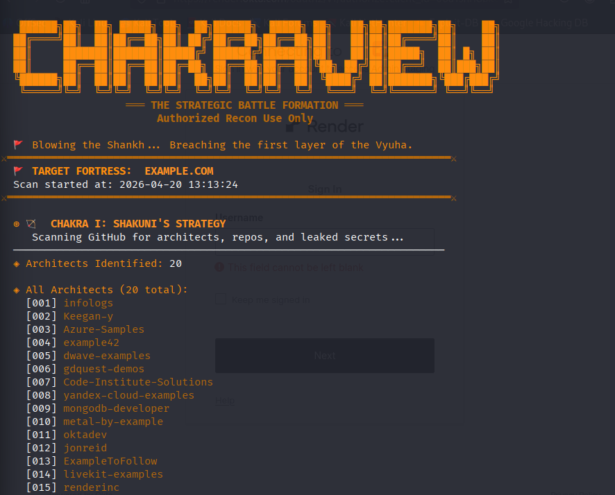
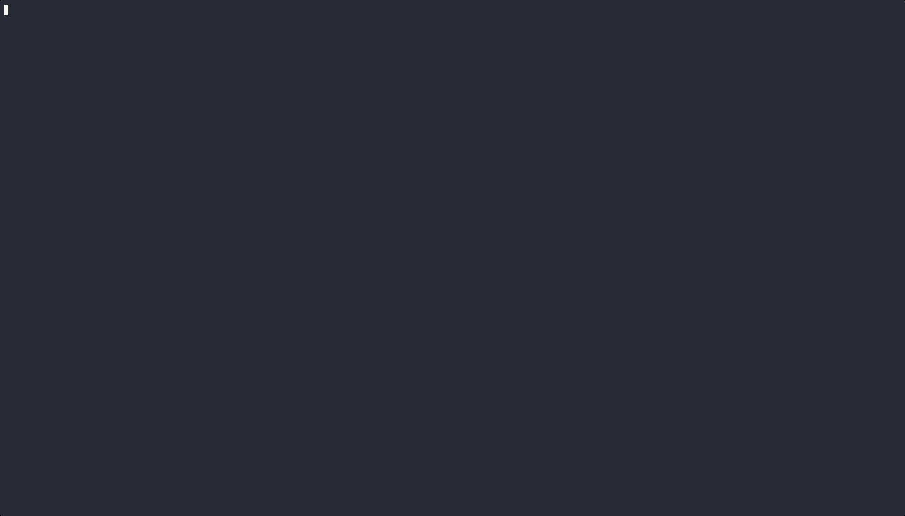

  

  

☸️ CHAKRAVIEW
> [!IMPORTANT]
> ### 🔍 The "Hidden Surface" Advantage
> Most security researchers fail to map the full digital footprint by relying on standard subdomain enumeration. **Chakraview** is engineered to uncover the "Invisible Recon"—the historical endpoints, leaked metadata, and infrastructure secrets that are often missed during a standard VAPT or Bug Bounty engagement.

Strategic Infrastructure Reconnaissance & Defensive Mapping Framework

Chakraview is a high-performance reconnaissance framework designed for Cybersecurity Analysts and Red Teamers. It automates the complex process of mapping an organization's digital attack surface by utilizing specialized modular "Chakras."
🏛️ Technical Architecture

The framework is architected into five distinct reconnaissance units:

    Module I (Shakuni): Advanced GitHub dorking engine targeting repository metadata and sensitive credential leaks.

    Module II (Sanjaya): Deep infrastructure profiling, including ASN discovery, Cloud provider identification, and WAF/CDN detection.

    Module III (Ashwatthama): Historical endpoint excavation utilizing Wayback Machine archives to find buried or decommissioned assets.

    Module IV (Karna): Logic-driven subdomain enumeration and active probing for service identification.

    Module V (Brahmastra): Precision Google Dorking payload generation for targeted information gathering.

🛠️ Installation & Setup
Prerequisites

    Python 3.8+

    Linux Environment (Optimized for Kali Linux)

Deployment
Bash

# Clone the repository
git clone https://github.com/mayurie-cysec/chakraview.git
cd chakraview

# Initialize isolated environment
python3 -m venv venv
source venv/bin/activate

# Install core dependencies
pip install -r requirements.txt

⚙️ Configuration

Chakraview utilizes a Bring Your Own Key (BYOK) model to avoid rate-limiting and ensure search privacy.

    Create a .env file in the root directory:
    Bash

    touch .env

    Add your GitHub Personal Access Token:
    Plaintext

    GITHUB_TOKEN=ghp_your_token_here

🚀 Usage

Execute the primary engine to launch the interactive interface:
Bash

python3 chakraview.py

📜 Disclaimer

This tool is strictly for Educational Purposes and Authorized Security Auditing only. The developer assumes no responsibility for unauthorized use or damages. Users are responsible for complying with local and international cyber laws.

🤝 Contributing

Contributions are welcome. Please ensure that all module updates follow the established naming convention and include proper error handling.
